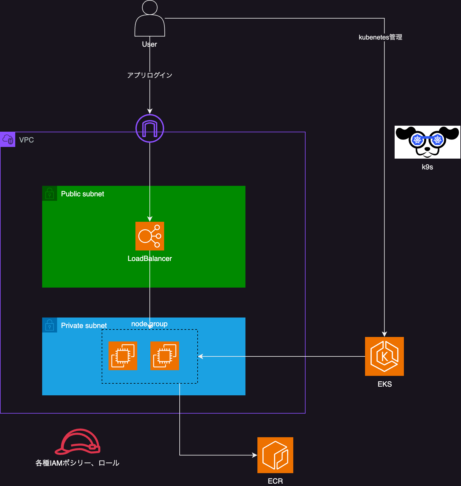
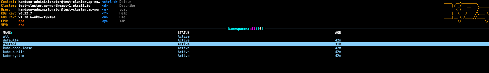
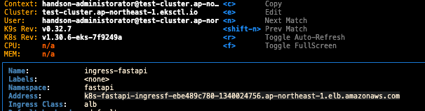
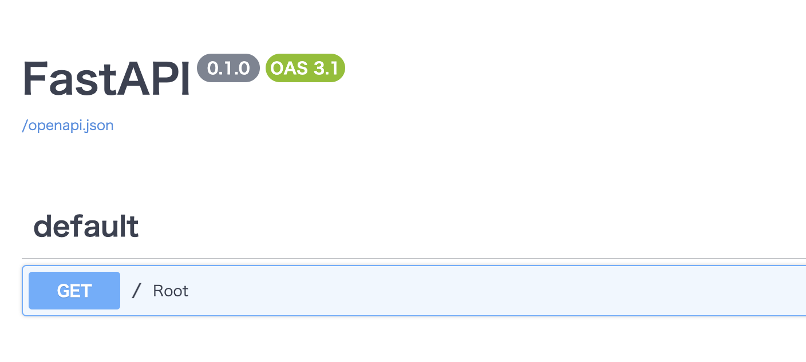

# EKS-ECR 

- クラウドでkubernetesのプレイグラウンドが欲しい人向けのリポジトリ
- makeコマンドでEKSclusterと、app下とdockerfileで定義したアプリをデプロイできる
- makeコマンドでEKSclusterとアプリをdeleteできる

 
# DEMO
make allで以下アーキテクチャが展開される


albを通じて、アプリケーションに接続できる


k9sを利用して、kubernetesの管理ができる


アプリコードを更新した後、以下コマンドでアプリケーションを更新できる
```
make update-app
```

 
# Features
 
- 手軽にEKS上のKubernetesクラスターを作成し、管理できる
- dockerとECRを利用して、アプリケーションをインターネットにデプロイできる。
 
# Requirement
  
* VSCode
* docker
* AWSアカウントと権限を持ったIAMユーザー
 
# Installation

- ローカルの~/.awsにアクセスキーなどの認証情報を設定する。<br>
https://docs.aws.amazon.com/ja_jp/cli/v1/userguide/cli-configure-files.html
- 当リポジトリをcloneまたはforkし、VSCodeで起動する。
- devcontainerを起動する。（dockerが起動している必要がある）

 
# Usage
 
devcontainer展開後、以下コマンドを実行する

```bash
make all
```

k9sでingressからalbのアドレスを特定



アクセスすると、fastapiのアプリに接続できる（/docsの追加でswagger UIの画面に遷移）<br>
起動後、場合によって10分程度のタイムラグが発生（原因調査中）


終了後、以下コマンドで作成したリソースを削除する
```bash
make delete-all
``` 
 
# Note 
- AWS利用料金がかかるので注意。EKSだけで1ヶ月放置すると1万円程度かかると思います。
- 作成したアプリケーションのエンドポイントは制限なくインターネットに公開されます。


 
